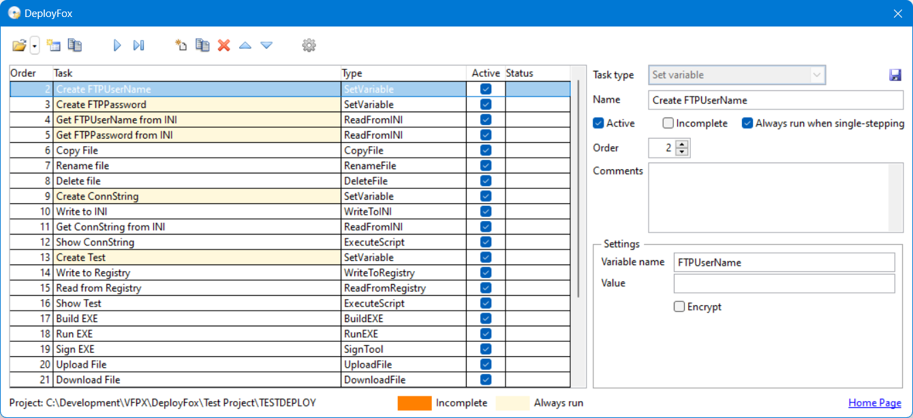

# DeployFox Documentation

To run DeployFox, DO DeployFox.app in the DeployFox folder or, if you used Thor to install it, choose DeployFox from the Thor Tools, Applications menu. The following dialog displays.



The dialog consists of four sections: a toolbar at the top, a list of tasks in the middle, properties about the selected task at the right, and a status bar at the bottom.

The toolbar has the following functions:

- : opens a DeployFox project. Click the dropdown button to display a list of previous opened projects.

- : creates a new DeployFox project in the folder you specify and with the name you choose.

- : clones the current project. This is useful if you need another project similar to the current one but with some differences.

- : runs (executes the tasks in) the project.

- : debugs the tasks in the project. Debugging is similar to running but starts from the selected task rather than the first one and after running a task asks if you want to run the next one or stop the execution. In other words, it single-steps through the tasks.

- : adds a task to the project. It's added as the next step but can be moved up to an earlier step.

- : removes the selected task.

-  and : moves the selected task up and down in the list and renumbers the steps accordingly.

- : displays the Settings dialog.

The list of tasks shows the order (step number), task name, task type, whether it's active, and the status of the last run (success or failure). You can make a task active or inactive by clicking the checkbox in the grid or in the properties for the selected task at the right (in the latter case, you have to click Save to save the change).

The properties for the selected tasks displayed at the right are:

- *Task type*: this can only be changed when a task is added; after it's saved, this is disabled. To change the type of a task, delete and re-add it.

- *Name*: the name of the task.

- *Active*: inactive tasks are skipped when the project is run.

- *Incomplete*: turn this on for tasks you're working on but haven't finished yet.

- *Always run when single-stepping*: some tasks are dependent on others. For example, some tasks use a variable so require that the task that sets the variables value execute before the task does. Turn this setting on for those tasks that always execute first before single-stepped tasks do.

- *Order*: the task order. You can either change the order by entering a different value or clicking the   and   buttons in the toolbar.

- *Comments*: comments or notes about the task.

- *Settings*: the settings for a task are specific to the task type and are discussed below.

The status bar displays the path for the open project file and a color chart showing the colors used in the grid for the status of the tasks.

## Task types

The types of tasks DeployFox supports are stored in a table, TaskTypes.dbf, along with the name of the PRG containing a class definition for the task (the class name must be the name of the task type, such as DeleteFile; all pre-defined tasks types are contained in Tasks.prg) and the VCX containing the UI for the settings for the task type (the class name must be TaskTypeUI, such as DeleteFileUI; the UI for all pre-defined tasks types are contained in TaskUI.vcx). If you want to create your own task types, subclass TaskBase in Tasks.prg into your own PRG, subclass TaskUIBase in TaskUI.vcx into your own VCX, and add a record for the task type to TaskTypes.dbf.

DeployFox comes with the following task types.

### CopyFile
Copies a file. The settings are the path for the file to copy (*From*) and the destination path (*To*).

### DeleteFile
Deletes a file. The only setting is the path for the file.

### RenameFile
Renames a file. The settings are the path for the file to rename (*From*) and the new name (*To*).

### DeleteFolder
Deletes a folder and all files in it and all subdirectories. The only setting is the path for the folder.

### WriteToFile
Writes to a file. The settings are the path for the file (which doesn't have to exist), the text to write, and whether the text should be appended to the file or overwrite any existing content.

### ZipFiles
Compresses one or more files into a ZIP file. The settings are the path for the ZIP file (which doesn't have to exist), a list of files to compress, and whether to create a new ZIP file or update an existing one.

### UnzipFile
Extracts the files in a ZIP file. The settings are the path for the ZIP file and the folder to extract the files to.

### DownloadFile
Downloads a file. The settings are the server, username, and password to connect to the server (if necessary), the path of the local file to download to, and the path of the remote file.

### UploadFile
Uploads a file. The settings are the server, username, and password to connect to the server (if necessary), the path of the local file to upload, and the path of the remote file.

### RunPRG
Executes a PRG. The settings are the path for the PRG file and any parameters to pass to it. Put quotes around any string parameters.

### RunEXE
Executes an EXE. The settings are the path for the PRG file, any parameters to pass to it, and the window mode (Normal, Hidden, Minimized, or Maximized). Put quotes around any parameters containing spaces or other illegal command line characters.

### RunBAT
Executes a Window batch (BAT) file. The settings are the path for the BAT file.

### ExecutePSScript
Executes a PowerShell script (PS1) file. The settings are the path for the PS1 file.

### ExecuteScript
Executes VFP code. The settings are the code to execute.

### ReadFromINI
Reads a value from an INI file into a variable. The settings are the path of the INI file, the section and item to read from, and the name of the variable to store the value to.

### WriteToINI
Writes a value to an INI file. The settings are the path of the INI file, the section and item to write to, and the value to write.

### ReadFromRegistry
Reads a value from the Windows Registry into a variable. The settings are the hive (such as HKEY_CURRENT_USER), key, and setting of the Registry entry and the name of the variable to store the value to.

### WriteToRegistry
Writes a value to the Windows Registry. The settings are the hive (such as HKEY_CURRENT_USER), key, and setting of the Registry entry, the value to write, and the value type (String, String with Unexpanded Environment Variables, and 32-bit Number)

### SetVariable
Saves a value to a variable, creating the variable if necessary. The settings are the variable name, the value, and whether the value is encrypted or not. Variables are discussed in the next section.

### BuildEXE
Builds an EXE from a VFP project. The settings are the path for the project, the path for the EXE, and whether to recompile all files.

### SignTool
Digitally signs a file. The settings are the path for the file to sign and the description to apply. This task uses SignTool.exe, which is included with DeployFox, and the settings stored in the Options dialog (discussed below).

### BuildSetupInno
Builds a setup executable from an Inno Setup script file. The settings are the path for the script file. Inno Setup, which you can download from <a href="https://jrsoftware.org/isinfo.php" target="_blank">https://jrsoftware.org/isinfo.php</a>, must be installed.

## Expressions and variables
Most settings can either be a literal value (such as "C:\SomePath\SomeFile.png") or an expression. To distinguish them, an expression is surrounded with curly braces; for example, "{fullpath('SomeFile.png')}."

DeployFox also allows you to define variables using a SetVariable task or the SetVariable function in a script executed with an ExecuteScript task. For example, if your DeployFox project has several tasks to upload files, you likely don't want to hard-code the server, username, and password in every task, so you can define variables to contain those values and then use the variables in the tasks. Here are three tasks that define such variables:

|Task Name       |Variable Name |Value      |Encrypted|
|----------------|--------------|-----------|--------|
|Set FTPServer   |FTPServer     |MyServer   |No      |
|Set FTPUserName |FTPUserName   |MyUserName |No      |
|Set FTPPassword |FTPPassword   |MyPassword |Yes     |

Variables are specified in an expression using a "$" prefix. Here's how the upload variables are used in a task.
 


You can also define or assign a value to a variable using the SetVariable function. The following code used in an ExecuteScript task runs gets the version number for the most recent Setup*.exe file (such as Setup0001.exe, Setup0002.exe, and so on) and assigns that value to the FormerVersion variable.

```
adir(laFiles, 'C:\Development\SFQuery\SQConfig\Installer\Output\Setup*.exe')
asort(laFiles, 3, -1, 1)
SetVariable('FormerVersion', strextract(laFiles[1, 1], 'setup', '.exe', 1, 1))
```

This task uses the FormerVersion variable to upload the former version of an installer to the FormerVersion folder of a web site:
 


Typically, you'll turn on Always run when single-stepping for tasks that assign values to variables so those variables exist and contain values when tasks that depend on them are run.

There are several built-in variables:

- $AppPath: the DeployFox folder.

- $BuildEXEWithInno: the command line to build a setup executable using Inno Setup.

- $CertPath: the path to the digital certificate (comes from the *PFX file* setting; see the next section).

- $CertPassword: the password for the digital certificate used to sign an EXE (comes from the *Password* setting; see the next section).

- $SignCommand: the command to sign an EXE (comes from the *Sign command* setting; see the next section).

- $SignEXE: the path to SignTool.exe, used to digitally sign an EXE.

## Settings
Click the Settings button in the toolbar to display the DeployFox Settings dialog.


There are three settings related to digitally signing an EXE:

- *Sign command*: the command used to sign an EXE. The default uses SignTool (the path to which is in the $SignEXE variable) to sign the EXE using the digital certificate specified in the PFX file setting.

- *PFX file*: the path to the digital certificate.

- *Password*: the password for the digital certificate.

Note: the mechanism used for digital signing requires a local PFX file and currently doesn’t support the new mechanism that uses a dongle.

*Task increment* specifies how much to increment or decrement a task order by when you click the up and down buttons.